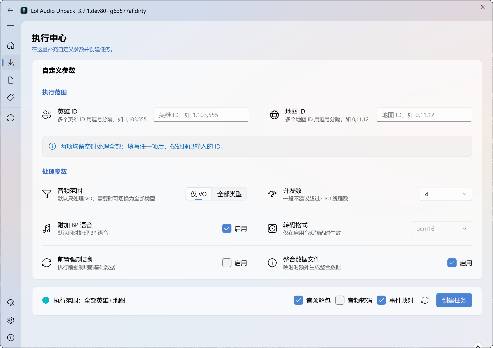

<p align="center">
  
</p>

<h1 align="center">Lol Audio Unpack</h1>

<p align="center">
  = 3.10">
  <a href="https://deepwiki.com/Virace/lol_extract_voice">
    
  </a>
</p>

<p align="center">一个极简、高效的英雄联盟音频提取工具。</p>

用它提取英雄联盟中的语音、音效和音乐，在界面里查找、试听和导出。
喜欢命令行或需要批量处理的话，也可以使用 CLI，或直接在 Python 中调用。

---

- [介绍](#介绍)
- [使用方法](#使用方法)
- [后续处理](#后续处理)
- [维护者](#维护者)
- [感谢](#感谢)
- [许可证](#许可证)

## 介绍

- 支持提取英雄、地图和本地资源包的 `VO`、`SFX`、`MUSIC` 音频。
- 默认输出原始 `.wem` 文件，文件名保留游戏数据中的原始 ID。
- 可以生成事件与音频的对应关系，方便按事件查找。
- 可以把音频转成 WAV，按事件查找，在界面中试听和导出。
- GUI 适合边浏览边处理；CLI 适合批量执行，也可以通过 Python API 接到自己的脚本中。

程序读取本地游戏文件。先准备好已安装的英雄联盟客户端，或符合要求的
[本地资源目录](docs/api/prepared_source.md)；工具本身不下载客户端资源。

## 使用方法

### 下载程序

不想配置 Python 环境，可以到 [GitHub Releases](https://github.com/Virace/lol_extract_voice/releases/latest)
下载程序，在 Assets 中按名称选择：

- **GUI**：`LolAudioUnpack-<version>-windows-x64.exe`，带图形界面，下载后直接打开。
- **CLI**：名称带 `LolAudioUnpack-CLI` 的控制台包，在终端中运行。它不包含 Qt，体积更小。

独立程序面向 Windows x64，不需要另外安装 Python。下载时以该版本实际提供的附件为准；
如果没有 CLI 附件，也可以使用下面的仓库运行方式。

### GUI



第一次打开时，跟随引导设置游戏目录和输出目录。列表准备好后，在执行中心选择英雄或地图，
勾选解包、转码、事件映射等需要的操作，再创建任务。

处理完成后，可以在实体总览中按事件查找、试听音频，也可以切换到“全部音频”，
通过“选择导出”把需要的文件转成 WAV。没有生成映射的音频，也能从“全部音频”中试听和导出。

界面会自动准备所需数据，不用先跑 CLI。特殊内容、本地 WAD 扫描和失败后的处理方式见
[GUI 使用说明](docs/gui/usage.md)。

### CLI

在 PowerShell 中运行控制台程序。例如，提取 Annie 和 Ahri 的语音：

```powershell
.\LolAudioUnpack-CLI.exe update extract --champions Annie,Ahri --game-path "D:/Games/英雄联盟"
```

英雄解包默认附带选人语音、禁用语音和选人音效，统一保存在 `lobby/`；不需要时添加
`--no-lobby-audio`。这三种大厅音频不受游戏内 VO/SFX 筛选影响。

需要 WAV 和事件映射时，可以把动作放在同一条命令里：

```powershell
.\LolAudioUnpack-CLI.exe update extract wav mapping --champions Annie --game-path "D:/Games/英雄联盟"
```

默认输出到终端当前目录的 `output/`，也可以用 `--output-path` 指定目录。英雄可以写 ID 或英文别名；
地图使用 `--maps 0,11` 这样的 ID 列表。完整参数用 `--help` 查看。

经常重复的任务可以保存到 INI 文件中，参考 [示例配置](config/lol-audio-unpack.example.ini)，
修改后用显式路径运行：

```powershell
.\LolAudioUnpack-CLI.exe -c ./任务.ini
```

使用 `-c` 时，动作和参数都从文件读取，不再混用命令行选项。
更多例子和路径规则见 [CLI 使用说明](docs/cli-package.md)，完整参数见 [CLI API](docs/api/cli_api.md)。

### 从仓库运行

已经有 Python 和 uv，或想直接使用仓库中的代码，可以这样安装：

```bash
git clone https://github.com/Virace/lol_extract_voice.git lol_audio_unpack
cd lol_audio_unpack
uv sync
```

运行 CLI 时，将上面命令中的 `.\LolAudioUnpack-CLI.exe` 换成 `uv run unpack` 即可：

```bash
uv run unpack update extract --champions Annie,Ahri --game-path "D:/Games/英雄联盟"
```

英雄和地图列表支持中英文逗号（如 `--champions "1，103"`）。CLI 遇到未知 ID 会停止并返回
退出码 `2`；GUI 可在创建任务时核对名字和 ID，确认跳过无效项后执行有效范围。

如果需要界面，再安装 GUI 依赖并启动：

```bash
uv sync --extra gui
uv run unpack-gui
```

### Python API

也可以直接在 Python 中调用相同的处理能力。安装仓库依赖后，下面的例子会更新并提取 Annie 的音频：

```python
from lol_audio_unpack import setup_app
from lol_audio_unpack.app import LolAudioUnpackApp, OperationOptions, ResultStatus

ctx = setup_app(settings={
    "GAME_PATH": "D:/Games/英雄联盟",
    "OUTPUT_PATH": "./output",
})
app = LolAudioUnpackApp(ctx)
opts = OperationOptions(champion_ids=(1,))

result = app.update(opts)
if result.status == ResultStatus.SUCCESS:
    result = app.extract(opts, include_maps=False)
print(result.status)
```

将脚本保存到仓库中，用 `uv run python 你的脚本.py` 运行。映射、WAV 转码和结果处理方式见
[Python API](docs/api/python_api.md)。其他文档可从 [文档导航](docs/README.md) 查找；
参与开发或自行打包请看 [开发文档](docs/development/README.md)。

## 后续处理

解包保留原始 `.wem` 文件和游戏中的音频 ID。GUI 和 CLI 都能转成 WAV；
如果只需要其中几条，用界面的“选择导出”会更方便。

**需要编辑音频时，请先导出或复制到资源库外。** 库内文件可能通过硬链接共享同一份内容，
直接修改会影响其他目录中的音频。目录组织和旧数据迁移说明见 [资源库说明](docs/api/library_api.md)。

需要额外的批量转换或其他格式时，也可以使用配套的
[vgmstream-cli-build](https://github.com/Virace/vgmstream-cli-build/releases)：

```powershell
.\vgmstream-cli.exe -o "?p?b.wav" "D:/audios"
```

## 维护者

**Virace**

- blog: [孤独的未知数](https://x-item.com)

## 感谢

- [@Morilli](https://github.com/Morilli/bnk-extract), **bnk-extract**
- [@Pupix](https://github.com/Pupix/lol-file-parser), **lol-file-parser**
- [@CommunityDragon](https://github.com/CommunityDragon/CDTB), **CDTB**
- [@vgmstream](https://github.com/vgmstream/vgmstream), **vgmstream**
- 以及 **JetBrains** 提供开发环境支持

  <a href="https://www.jetbrains.com/?from=kratos-pe" target="_blank"></a>

## 许可证

[GPLv3](LICENSE)
